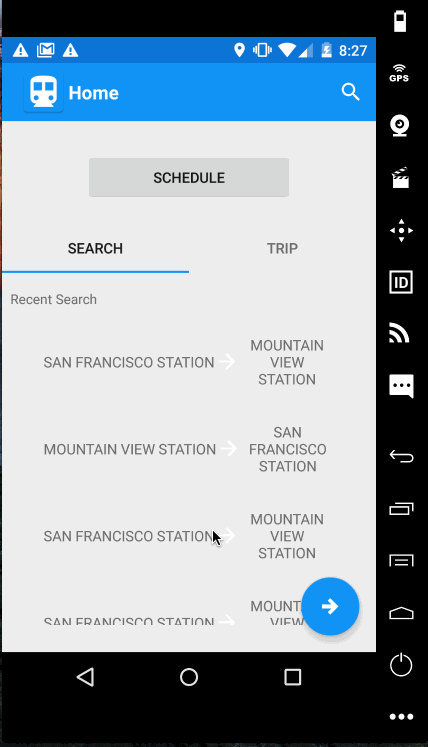
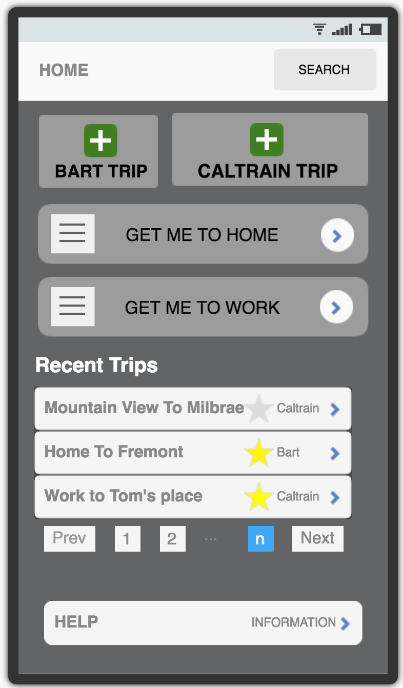
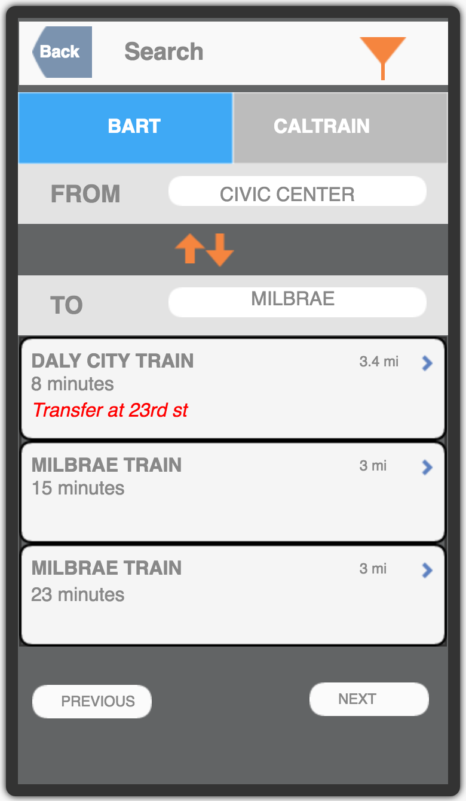
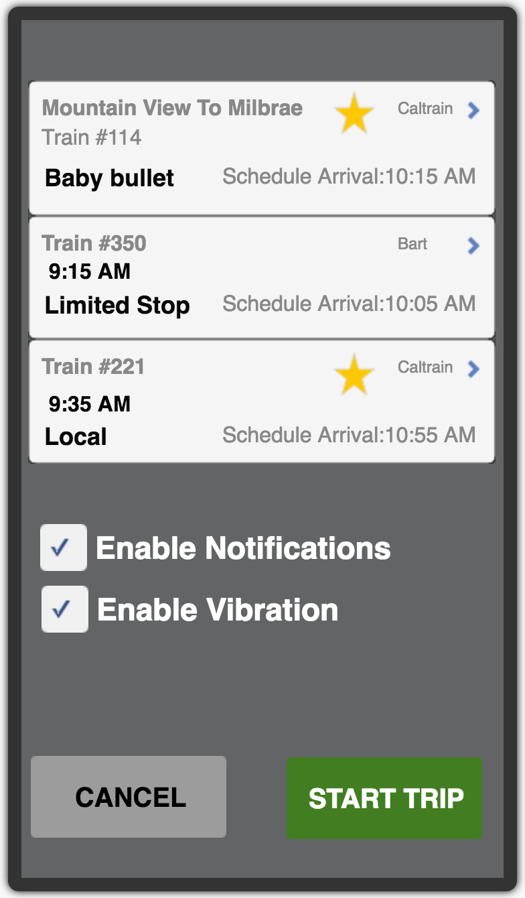
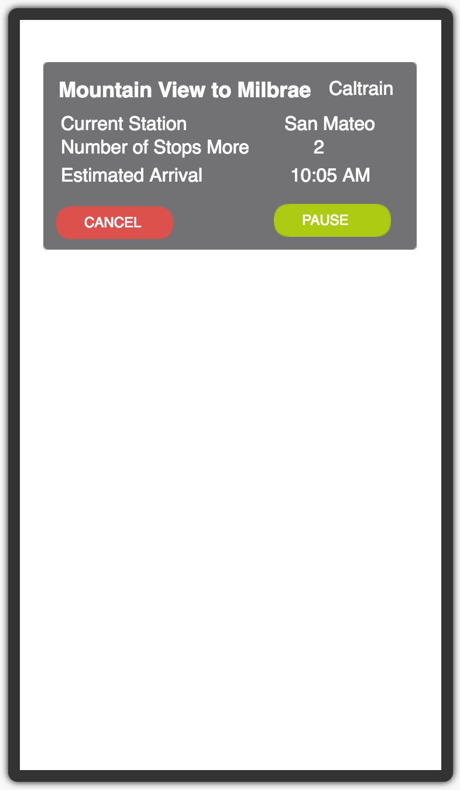

# TransitAngel
## Overview of the project
 Transit Angel provides a way for users to plan trips and most importantly get notifications one stop before their upcoming destination on public transports. This app is designed for everyone but we are specially taking in consideration the users who rely heavily on phone’s accessibility features for getting realtime information to plan their daily commute without relying on anyone else.
 
## User Need 
Imagine a blind person who is new to the city and  just needs to travel from San Jose to San Francisco via public transit. He needs to figure out which station to go to, find the right train , board it and then rely on fellow passengers to help notify when he/she reaches their destination. The voice alerts in the train announced by the driver are hardly audible with the all the surrounding noise. TransitAngel tries to help ease this process and remove the frustration! The app helps users to plan  trips and get real-time ,on-demand notifications about the current place and upcoming destination while riding on a public transit. Though the app could be used by anyone who is using the public transit , we are specifically optimizing the app for visually impaired users.

## User stories (**required**)
  - Users should be able to add multiple trips with from and to destination
  - Users should be able to select specific train or time frame while setting up the trip
  - Users should be able to see time table information about the train schedule (In a paginated view)
  - Users should be able to favorite recent searches and create labels for trips if they like
  - User should be able to Start a trip at any point while in the train with final destination setup
  - User should be able to stop or pause the trip at anytime
  - User should be able to get notification (Voice or Vibrate) one stop before for them to get prepared
  - User should be able to set up trips for both Caltrain and Bart
  - User should be able to shake the device to get information about the upcoming station
  
## User Stories (**optional**)
  - User could customize notifications (i.e. get notified 2 station before or get notified for every station)
  - User could be delay information about any saved trip proactively via a push engine
  - Add additional services like Muni and other public transportation
  - Add Smart notifications which could give them about upcoming train information learning from their usage pattern of the app. Eg. If they open the app at 7 AM and 5 PM, we could make use of this information to give them information about directions and delay information before hand.
 
## WalkThrough(Sprint1)

## Wireframes

### 1. Home Screen

### 2. Search Screen

### 3. Trip Info Screen

### 4. Trip Started Screen

[Fluid working prototype] (https://www.fluidui.com/editor/live/preview/p_cixcZ09rkHMCucNTgQfan4oGan2mEkOi.1471293945783) 

Credit : Fuild Wireframe
